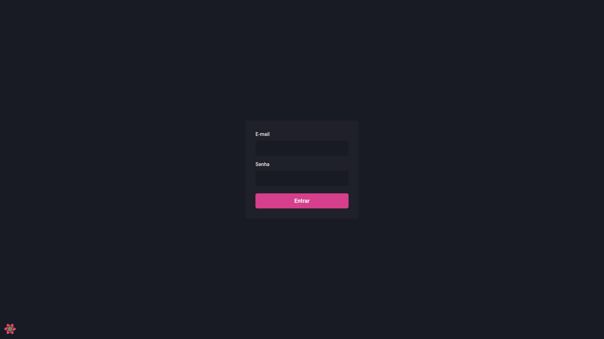

<div>
  <h1 align="center"> 
    Dashgo.
  </h1>
  <h2 align="center"> 
   Building interfaces of the future - Data fetching and Local caching
  </h2>
  <h3 align="center"> 
    Module 4 - RocketSeat -  Ignite ReactJS 🔥
  </h3>

  <p align="center">
    <a href="https://rocketseat.com.br">
      
    </a>
    <a href="https://github.com/jorgeeder"> 
      
    </a>
    
    
    <a href="https://opensource.org/licenses/MIT">
      
    </a>
  </p>
</div>

## About The Project

Interface of an administrative panel using Chakra UI in Next.js and to improve the experience of using the application, a data cache layer was created between the front-end and back-end used React query.


## Features

-   Dashboard
-   Authentication flow
-   User registration
-   User listing


## Technologies

-   **[Next.js](https://nextjs.org/)**
-   **[TypeScript](https://www.typescriptlang.org/)**
-   **[Chakra Ui](https://chakra-ui.com/)**
-   **[React Query](https://tanstack.com/query/v4)**


## Application in Use




## Requirement

-   **[Node.js](https://nodejs.org/)**


## Running The Project

```bash

# You can use npm package manager or yarn to run the commands below

## Clone the repository
git clone https://github.com/jorgeeder/dashgo.git

## Access the project folder in the terminal
cd dashgo

## Download project dependencies
yarn # or npm install

## Run the project
yarn dev  # or: npm run dev
## Access in the browser http://localhost:3000
## Access in the browser http://localhost:3000/dashboard
## Access in the browser http://localhost:3000/users

```
## License

This project is under the MIT license. See the [LICENSE](/LICENSE) file for more details.


<div align="center">
  <p> Made with 💜 by <a href="https://github.com/jorgeeder">Jorge Eder</a> </p>
  <p>
    <a href="https://www.linkedin.com/in/jorgeeder/">
      
    </a>
    <a href = "mailto:jorgeeder.dev@gmail.com">
      
    </a>
  </p>
</div>